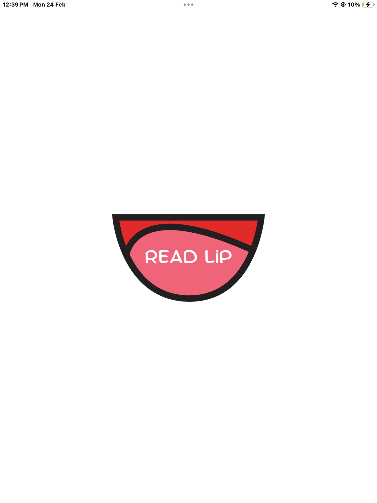
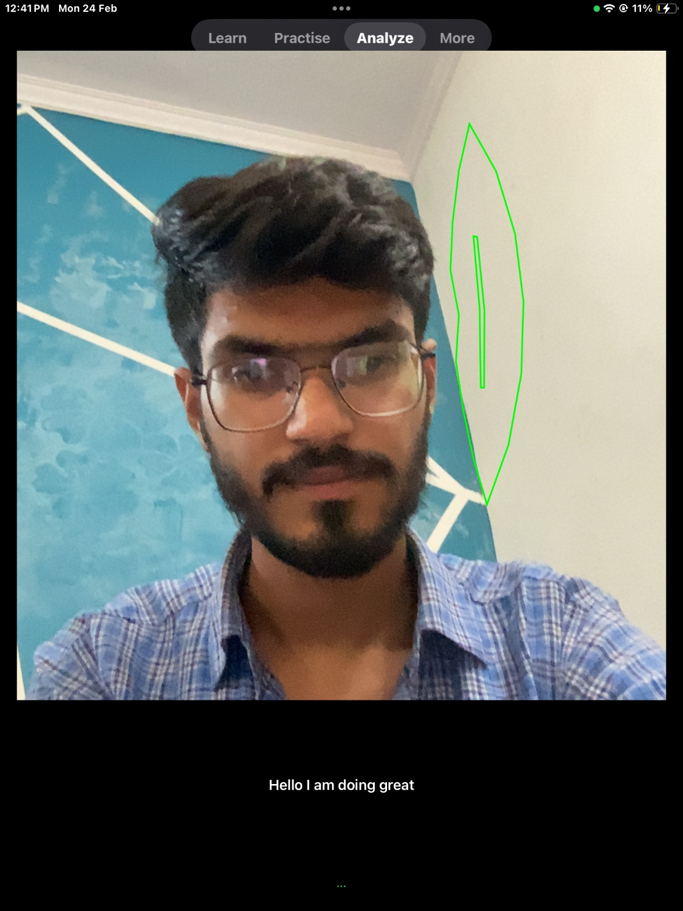
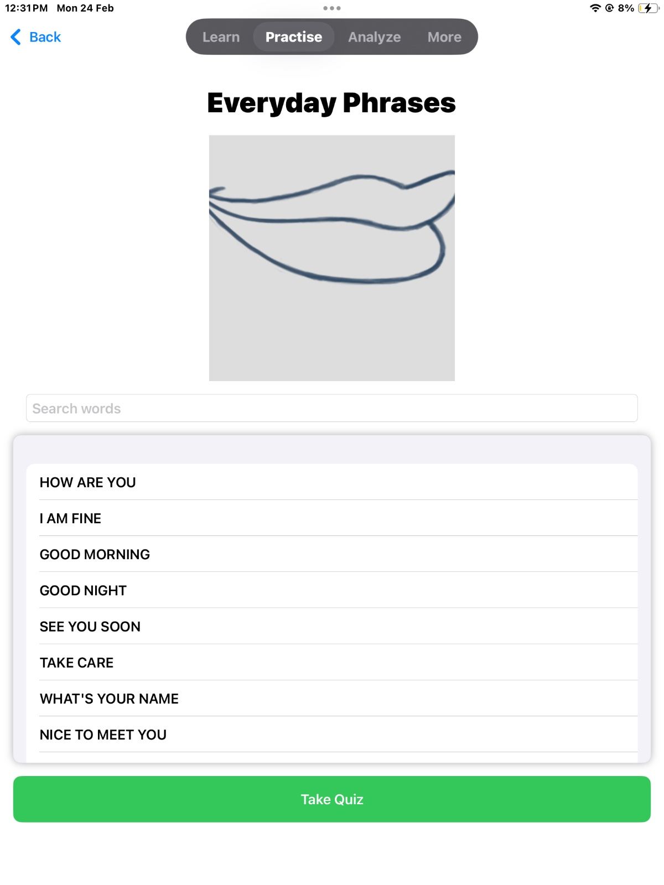
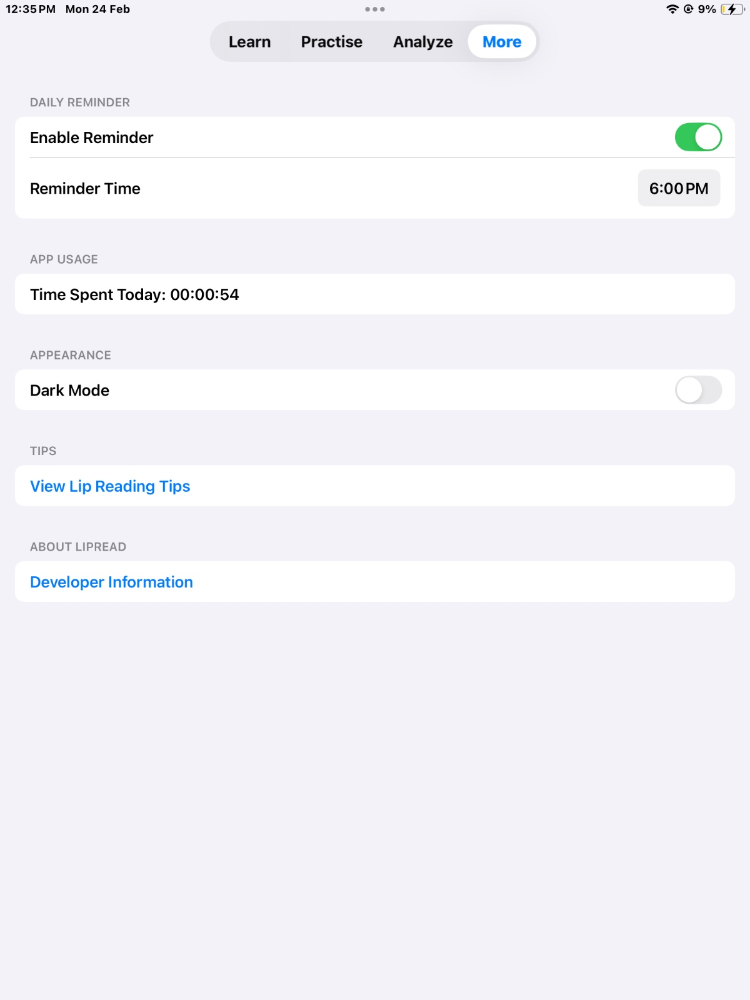
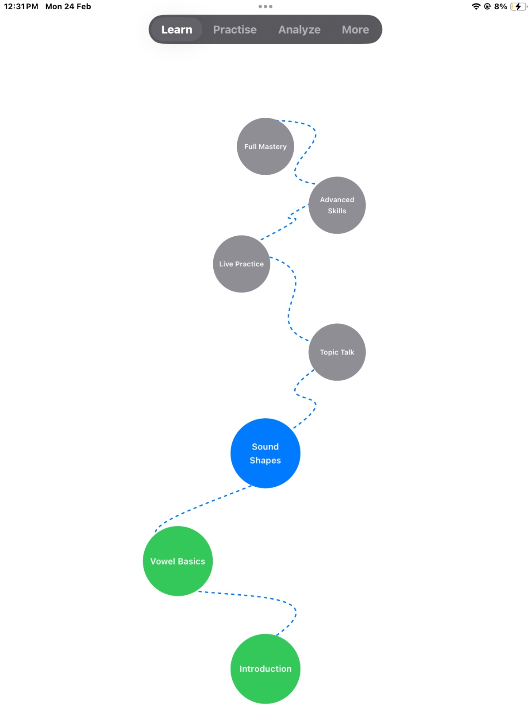

# Read Lip: Lip-Reading iOS App

An immersive iOS app designed to teach lip-reading using various Apple frameworks.

## Technologies Used
- **SwiftUI:** Modern and responsive user interface
- **SpriteKit:** Interactive animations and engaging visuals
- **Speech & Vision:** Real-time speech recognition and lip-reading
- **AVFoundation:** Audio and video synchronization for feedback

## Features
- Multi-level lip-reading course
- Interactive games and quizzes
- Comprehensive dictionary of lip shapes
- Real-time lip-reading with instant feedback

[Demo Link](https://drive.google.com/file/d/1OPlOf2av-m9EL_g7pbwWwQ9utzg6_TZd/view?usp=sharing)

## Screenshots

